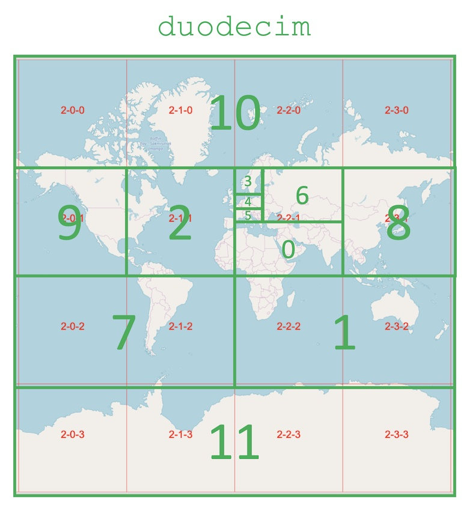

# duodecim
Divisions of the globe in 12; improved version of decimundus

| no. | number of z=6 modules | size of miniplanet.osm.pbf |
|-----|-----------------------|----------------------------|
| 0   | 128                   | 4.8GB                      |
| 1   | 512                   | 4.8GB                      |
| 2   | 256                   | 11GB                       |
| 3   | 16                    | 1.5GB                      |
| 4   | 8                     | 9.2GB                      |
| 5   | 8                     | 8.0GB                      |
| 6   | 96                    | 5.4GB                      |
| 7   | 512                   | 1.9GB                      |
| 8   | 256                   | 4.8GB                      |
| 9   | 256                   | 6.0GB                      |
| 10  | 1024                  | 512MB                      |
| 11  | 1024                  | 29MB                       |
